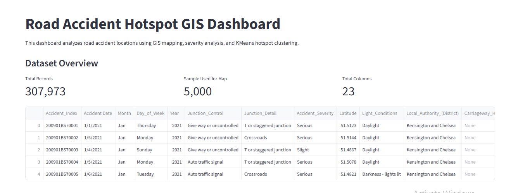
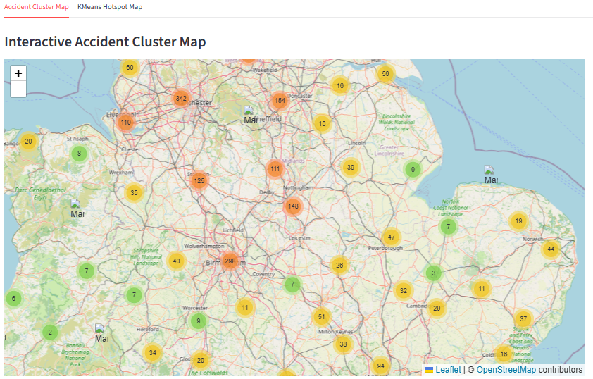
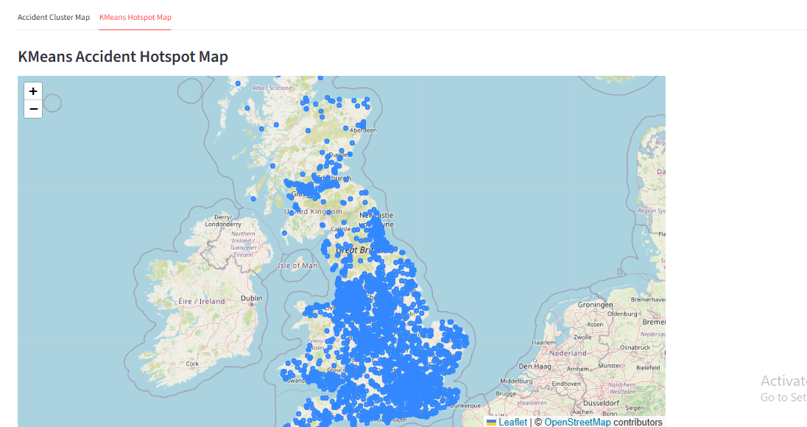
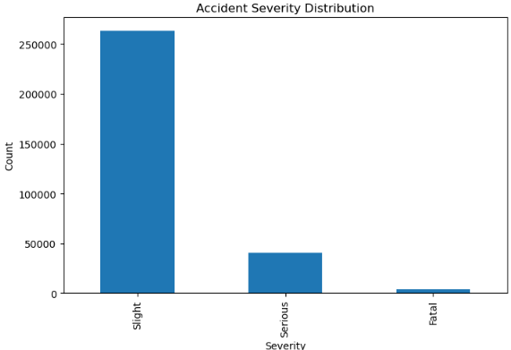

# Road Accident Hotspot GIS Dashboard

## Project Overview

This project demonstrates the use of GIS mapping, geospatial visualization, and machine learning clustering techniques for road accident hotspot analysis.

The dashboard analyzes accident location data using latitude and longitude coordinates to identify high-density accident regions and visualize accident severity patterns. KMeans clustering was applied to detect accident hotspot groups based on geographical coordinates.

An interactive Streamlit dashboard was developed to support geospatial accident analysis and public safety monitoring.

---

# Dashboard Screenshots

### Dashboard Overview



### Accident Cluster Map



### Hotspot Map



### Severity Distribution



---

# Objectives

* Perform exploratory analysis on road accident datasets
* Visualize accident locations using GIS mapping
* Identify accident hotspot regions using clustering techniques
* Analyze accident severity distributions
* Develop an interactive geospatial dashboard
* Demonstrate GIS-based public safety analytics

---

# Dataset Information

Dataset:

* Road Accident Dataset

Total Records:

* 307,973

Deployment Sample:

* 5,000 records used for interactive dashboard performance optimization

Key Features:

* Latitude
* Longitude
* Accident Severity
* Date
* Time
* Weather Conditions
* Road Surface Conditions
* Speed Limit

---

# Technologies Used

| Technology       | Purpose                       |
| ---------------- | ----------------------------- |
| Python           | Data analysis and development |
| Pandas           | Data processing               |
| NumPy            | Numerical computation         |
| Matplotlib       | Data visualization            |
| Folium           | GIS map visualization         |
| Streamlit        | Interactive dashboard         |
| Scikit-learn     | KMeans clustering             |
| Streamlit-Folium | Streamlit GIS integration     |
| GitHub           | Version control and hosting   |

---

# Machine Learning & GIS Analysis

GIS Features:

* Latitude
* Longitude

Machine Learning Method:

* KMeans Clustering

Cluster Count:

* 5 hotspot clusters

Highest Density Cluster:

* Cluster 1

Analysis Performed:

* Accident hotspot detection
* Geospatial clustering
* Severity distribution analysis
* Interactive accident mapping

---

# Dashboard Features

* Interactive GIS accident map
* Marker clustering visualization
* KMeans hotspot analysis
* Severity distribution charts
* Dataset overview and exploration
* Public safety hotspot visualization

---

# Project Structure

02_Road_Accident_Hotspot_GIS/

├── data/

├── notebooks/

├── screenshots/

├── app/

├── README.md

├── requirements.txt

└── main.py

---

# Installation Guide

## Clone Repository

```bash
git clone YOUR_GITHUB_REPOSITORY_LINK
```

## Install Dependencies

```bash
pip install -r requirements.txt
```

## Run Dashboard

```bash
streamlit run app/dashboard.py
```

---

# Future Improvements

* Integrate real-time traffic accident APIs
* Add heatmap visualizations
* Include GIS shapefile layers
* Perform predictive accident analysis
* Add weather-based accident forecasting
* Integrate advanced geospatial analytics

---

# Limitations

* Dashboard uses sampled data for performance optimization
* Current analysis uses static historical datasets
* Real-time traffic integration is not yet implemented

---

# Conclusion

This project demonstrates how GIS visualization and machine learning clustering techniques can be applied for road accident hotspot analysis and public safety monitoring.

The developed dashboard supports geospatial exploration of accident patterns and provides an interactive platform for identifying high-density accident regions using GIS-based analytical techniques.
